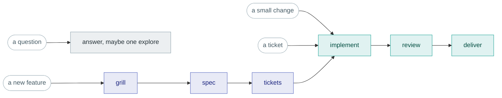

# radar

A ready-made agent setup for [Omnigent](https://omnigent.ai/): an orchestrator
that classifies what you ask for, hands the work to specialised sub-agents, and
gets out of the way.

**Every step is an entry point. Every step is skippable.**

- Ask for a typo fix → you get a typo fix.
- Ask for a feature → interview, spec, tickets, then one ticket at a time.
- You say yes at each point. Nothing is required because a pipeline says so.

That is the whole design. Its predecessor enforced idea → spec → approval →
ticket → code → test → review → docs → PR, with a policy refusing any code
change without an approved spec and a linked ticket. Rigorous, and unusable for
the small tasks that make up most days. radar keeps every stage available and
makes each one optional.

What makes it different from "an agent that writes code":

| | |
|---|---|
| **Writes nothing itself** | The orchestrator classifies, dispatches, reports, asks. When a worker says tests pass, it relays that — it does not check. Verification is a step you opt into. |
| **Proposes the cheapest fit** | Escalating costs you one word. Ceremony you did not need costs a spec and twenty minutes. |
| **Leaves the diff uncommitted** | Until you say otherwise, so you can read and annotate it in Omnigent's changed-files view while it is still open. |

## Install

```bash
git clone git@github.com:ifahrentholz/omnigent-radar.git
cd omnigent-radar && ./install.sh
```

Links `bin/radar` into `~/.local/bin`. Elsewhere: `--dir ~/bin`. Undo:
`--uninstall`. **Your shell config is not touched** — a symlink in a PATH
directory works in every shell and cannot break a login shell.

Checked by the script:

| | |
|---|---|
| `git` | radar works only inside git repositories |
| `omnigent` | not installed for you — see [omnigent.ai](https://omnigent.ai/) |
| a Claude provider | run `omnigent setup` if none is configured |
| `gh` / `glab` | only for the tracker your project actually uses |

Then, in any project:

```bash
cd your-project
radar
```

**You speak first.** Omnigent has no agent-initiated turn, so the orchestrator
leads its *first reply* with the project's status instead of greeting you.

**Windows:** via WSL. The bundle runs unchanged there.

## Lanes

A lane is a suggested chain through the steps. The orchestrator picks one,
proposes it in a line, and you accept or redirect.



| Lane | You say | Chain | State? |
|---|---|---|---|
| **0 · chat** | *"how does the auth flow work?"* | answer, or one `explore` | no |
| **1 · quick** | *"bump the lockfile"* | `implement` → `deliver?` | no |
| **2 · ticket** | *"implement #412"* | `implement` → `review` → `deliver` | no |
| **3 · feature** | *"I want to build X"* | `grill` → `spec` → `tickets` → lane 2 per ticket | yes |

- **Ambiguous → the cheaper lane.** You can always say "make it a feature".
- **Enter anywhere.** Missing a spec is mentioned, not enforced.
- **Not lanes, available any time:** `onboard` (derive repo conventions once),
  `learn` (record a lesson).

### After every step

```
✓ implement → branch feature/412-login · 4 files

Gates — all green (per coder)
- pnpm tsc --noEmit
- pnpm vitest run (12/12)

add review?

[yes / no, straight to deliver]
```

**The first option is the default** — you still type a word, since Omnigent
will not send an empty message. Short forms and free text both work. Say *"go
through to the MR"* and it stops only at real decisions: spec approval, a
blocked step, a failed worker.

## Steps

| Step | Runs on | Produces |
|---|---|---|
| `onboard` | orchestrator | `.omnigent/project/vcs.md` |
| `explore` | `explorer` | findings report |
| `grill` | orchestrator | sharpened problem and scope |
| `spec` | orchestrator | `docs/specs/<slug>.md` with `AC-1…n` |
| `tickets` | `ticketer` | issues in dependency order |
| `implement` | `coder` | branch, **uncommitted** diff, gates run |
| `design` | `designer` (opt-in) | presentation-only diff |
| `review` | `reviewer` | findings, gates re-run, risk map |
| `deliver` | `scribe` | commit, push, MR/PR opened |
| `learn` | orchestrator | one line in `.omnigent/learnings.md` |

`grill`, `spec` and `learn` stay with the orchestrator because they are
conversations — a sub-agent runs autonomously and cannot hold a dialogue.

## Workers

| Worker | Model | May push | Read-only |
|---|---|---|---|
| `explorer` | opus [1m] | – | in effect (`worktree_guard`) |
| `coder` | opus [1m] | – | – |
| `reviewer` | opus [1m] | – | yes (`read_only_os`) |
| `ticketer` | opus [1m] | – | – |
| `scribe` | sonnet | **yes** | – |
| `designer` | opus [1m] | – | – |

- **Only `scribe` may push** — enforced by policy, not by asking nicely.
- **The `reviewer` never sees the coder's report or reasoning** — only branch,
  diff and acceptance criteria. With a single vendor, context isolation is where
  review independence comes from.

## Review, and the round trip in Omnigent

Human review capacity is the bottleneck, not agent output. `review` does three
things, and the first is easy to miss:

1. **Re-runs the project's gates** against the branch — independently, finding
   them itself. This is the **only verification in the bundle**. The
   orchestrator never checks a worker's claim; this step is where "the tests
   pass" stops being hearsay.
2. **Findings** — what is wrong, judged against the acceptance criteria.
3. **A risk map** — where nobody has checked.

"Critical" in the risk map means *unreviewed by construction*, not "looks
important": changed code no test exercises, changed code no acceptance
criterion covers, files git says are fragile. A model's sense of importance
tracks where it was already being careful — which is exactly where it is least
likely to be wrong.

All three land in Omnigent's changed-files view as annotations on the code:

| Mark | Meaning | How many |
|---|---|---|
| `🛑 BLOCKER` | contract unmet, or the code is wrong | every one, posted first, never trimmed |
| `⚠︎ HINWEIS` | non-blocking finding | every one |
| `⚑ UNGEPRÜFT` | risk map: nobody has checked here | up to ~10 marks in total |

### The loop

1. **`implement` leaves the diff uncommitted** — that is what makes it visible
   at all. Omnigent's changed-files view reads `git status`, so a committed
   change is invisible to it.
2. **Read it at the code.** The orchestrator also prints the findings in chat,
   so you can decide without opening the diff.
3. **Add your own annotations** wherever you disagree or want something else.
4. **Select them and send them to the agent.** The orchestrator routes the whole
   batch to the `coder` as one fix task — same branch, same uncommitted tree,
   your wording passed through verbatim.
5. **Repeat, or move on** to `review` again or `deliver`.

Two things worth knowing:

- **Agent annotations appear under your own name.** Omnigent records no author
  in single-user mode, so every body starts with `🤖 radar · ` — that prefix is
  the only thing distinguishing the reviewer's notes from yours.
- **"addressed" does not mean done.** Omnigent flips a comment's status when you
  send it, before any agent has seen it. Only the coder's result says it is
  fixed.

## Your project's own skills

If the repository you are working in ships skills of its own under
`.claude/skills/`, radar and its workers can use them. They appear in the same
listing as the bundle's, and any agent can invoke them by name. Nothing needs
configuring: a project that writes its deploy procedure or its house test
conventions down as a skill gets that procedure followed here.

This is also why every skill in this bundle is named `radar-…`. The Skill tool
resolves an exact name before a plugin-qualified one, so a project skill called
`implement` would otherwise be invoked in place of the bundle's implementer. The
prefix keeps the two apart in both directions — yours cannot shadow ours, and
ours cannot shadow yours.

Two consequences worth knowing:

- **Your personal `~/.claude/skills/` load as well.** There is no way to take the
  project tier without the user tier: Omnigent does not expose the setting that
  separates them. A large personal collection costs tokens in every turn, and
  makes radar behave a little differently on your machine than on a colleague's.
- **A project skill is instructions, not a sandbox.** Read one before you trust
  it in a repository you did not write.

## Extending it

The six workers are a starting set, not a fixed roster. Everything you add stays
inside the bundle, so a colleague who clones the repo gets your additions with
it.

**Add a worker:**

1. `agents/radar/agents/<name>/config.yaml` — model, prompt, `os_env`, guardrails.
   Copy an existing one; `explorer` is the smallest.
2. Add `<name>` to `tools.agents` in `agents/radar/config.yaml`. That list is
   what registers it — without the entry the directory is inert.
3. Tell the orchestrator when to use it: a row in the step menu of
   `agents/radar/skills/radar-lanes/SKILL.md`, and a line in its per-worker notes.

**Add a skill:**

1. `…/skills/radar-<name>/SKILL.md`, with `name: radar-<name>` and a
   `description:` in its frontmatter — under `agents/radar/skills/` for the
   orchestrator, or under `agents/radar/agents/<worker>/skills/` for a worker.
   Keep the prefix; it is what stops a same-named skill in the host project or
   in `~/.claude/skills/` from taking its place.
2. Reference it from that agent's prompt, or from another skill. There is no
   list to add it to — every agent runs `skills: all`.

Two traps worth knowing before you hit them:

- **`skills:` has no middle setting.** `none` resolves to an empty allowlist and
  rejects *every* skill call, the bundle's own included. A list of names is an
  allowlist too, and it has no wildcard, so it hides the host project's skills
  completely. `all` is the only value that admits both.
- **`disable-model-invocation: true`** in a skill's frontmatter blocks explicit
  `Skill` calls too, not just implicit triggering — the error says "ask the user
  to run /<name> themselves", and a headless worker has no user to ask.

A worker sees its own bundled skills plus the host's. The orchestrator's bundled
skills do not reach the workers, and one worker's do not reach another.

## What appears in your project

```
.omnigent/
  project/vcs.md    # commit — branch naming, commit format, tracker, labels
  learnings.md      # commit — rules from past sessions, capped at ~40 lines
  state.json        # commit — only for a lane-3 feature in flight
  runs/             # gitignore — worker reports
```

That is all of it. There is deliberately **no summary of your codebase** — no
architecture, conventions or domain file. An earlier version wrote them and
results got worse: a description of the code turns into a prescription over it,
it is stale the moment it is written, and it replaces the agent's own reading
with someone else's compression.

**The bundle is the method; `.omnigent/` is the knowledge.**

## Self-improvement

- **A project rule** → `.omnigent/learnings.md` in the target repo. Written only
  once it has already cost someone a wrong turn.
- **A method change** → a prompt or skill edit in this bundle, committed here.

Only the second is real self-improvement. Filing a method problem as a project
rule fixes it in one repo and lets it recur in every other one.

## Layout

```
install.sh                  # prerequisite check + symlink
bin/radar                   # launcher; resolves the bundle through the symlink
agents/radar/
  config.yaml               # the orchestrator
  skills/
    radar-lanes/            #   ← the routing procedure, the core of the bundle
    radar-onboard/  radar-learn/
    radar-grilling/  radar-grill-me/  radar-grill-with-docs/
    radar-to-spec/  radar-domain-modeling/
  agents/<worker>/
    config.yaml
    skills/                 # bundled with the worker that runs them
```

## Licence

MIT, except `agents/radar/agents/designer/skills/radar-frontend-design/`, which is
Apache-2.0 and carries its own `LICENSE.txt`.
